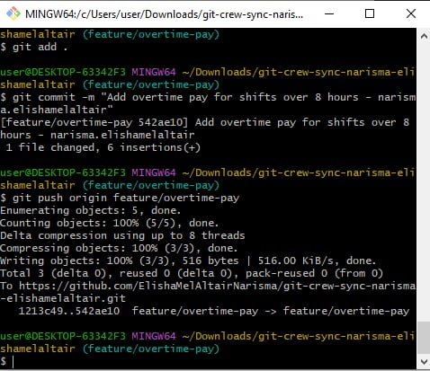
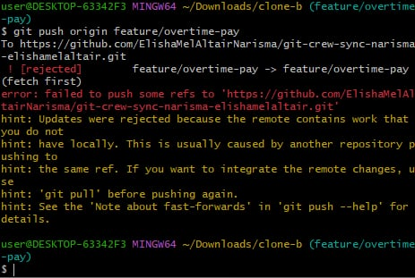
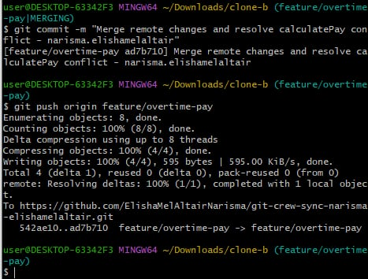
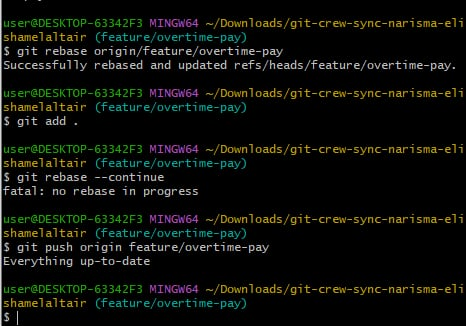
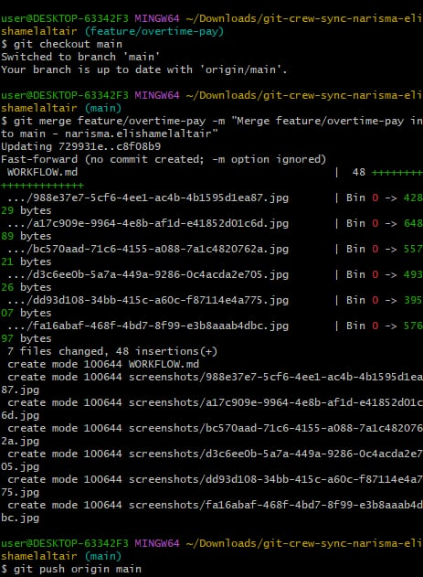
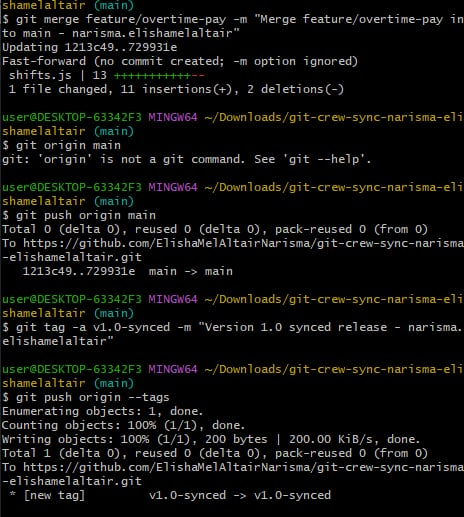

# Git Crew Sync Lab Workflow

## Student Information
- **Name:** Narisma, Elisha Mel Altair
- **Repository:** git-crew-sync-narisma-elishamelaltair

---

## Completed Tasks Overview

### Task 1: Setup and Synchronization
- Initialized repository and connected local branches to GitHub.

### Task 2: Feature Branch Work
- Worked on the `feature/overtime-pay` branch and created initial shift tracking functions in `shifts.js`.

### Task 3: Simulating Collaborative Conflicts
- Made updates across two separate working directories (Clone A and Clone B) to simulate real-world team pushes.

### Task 4: Push Rejection and Rebase Resolution
1. Made local commits in Clone A while Clone B pushed new changes to `origin/feature/overtime-pay`.
2. Attempted to push from Clone A, resulting in an expected push rejection (`! [rejected]`).
3. Ran `git fetch origin` to pull remote references.
4. Executed `git rebase origin/feature/overtime-pay` to replay local commits over the remote branch.
5. Resolved merge conflicts in `shifts.js` by removing conflict markers (`<<<<<<<`, `=======`, `>>>>>>>`).
6. Staged changes using `git add .`, finalized the rebase via `git rebase --continue`, and pushed to GitHub.

---

## Screenshot Proof

### Task 1 Screenshot

### Task 2 Screenshot

### Task 3 Screenshot

### Task 4 Screenshot

### Task 5 Screenshot

### Task 6 Screenshot

## Workflow Reflection Questions

### 1. What did the rejected push error message tell you, and why did it happen?
The error message (`! [rejected] - fetch first`) indicated that the remote branch contained commits that did not exist in my local branch. This happened because another clone (Clone B) pushed new commits to `origin/feature/overtime-pay` while my local workspace (Clone A) was behind, causing the two histories to diverge.

### 2. What's the actual difference between how you resolved Task 3 (merge) vs Task 4 (rebase)?
In Task 3, `git merge` created a new 3-way merge commit that joined both branch histories together, preserving the exact chronological sequence of both clones. In Task 4, `git rebase` temporarily stashed my local commits, updated my base branch to match `origin/feature/overtime-pay`, and then replayed my local commits on top of it, creating a linear project history without extra merge commits.

### 3. What one habit would have avoided both rejected pushes in this lab?
Running `git fetch` (or `git pull`) to pull remote changes before starting new work or attempting to make local commits and pushes would have prevented both rejected push errors.

### 4. Which approach — merge or rebase — would you default to on a shared team branch, and why?
I would default to `git merge` on a shared team branch (or use pull requests) because rebasing rewrites commit history. Rewriting history on public shared branches can cause synchronization issues for other developers pulling from the same branch.